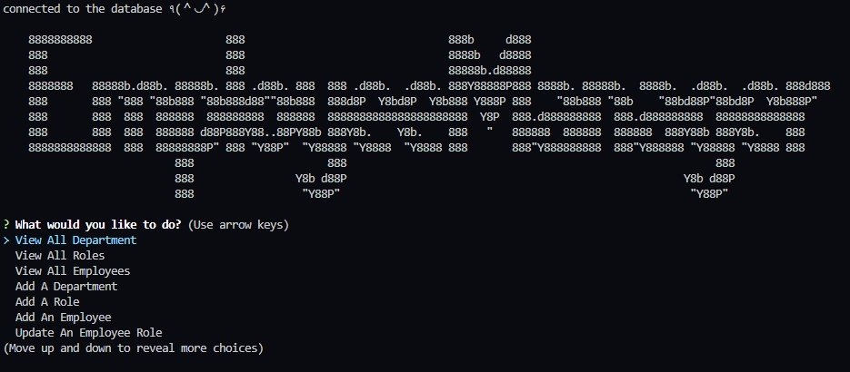

# Employee-Manager
;

## Description

An interface that allows non-developers to easily view information about a company's departments, roles within those departments, and the employees that work in those roles. The interface also allows you update and change department, roles, or employee information.  

## Table of Contents

- [Installation](#installation)
- [Usage](#usage)
- [Credits](#credits)
- [License](#license)

## Installation

1. Clone the repo @git@github.com:brownKasey/Employee-Manager.git
2. Go to where the folder is in a terminal. 
3. login to mysql using the .env.example file and run 'Source db/schema.sql' and 'Source db/seeds.sql'. 
4. Run 'node server.js'.

## Usage

Clone the repo @git@github.com:brownKasey/Employee-Manager.git

Go to where the folder is in a terminal.

Login to mysql using the .env.example file(change the username and password to match what your personal information, then rename the file to '.env') and run 'Source db/schema.sql' and 'Source db/seeds.sql'. 

Run 'node server.js'. 

Below is a picture of what you'll see in the terminal

Video Tutorial: https://drive.google.com/file/d/17qoyMPkNcrhdTWD965qQnleij2j2oTTc/view?usp=sharing

You can scroll with the up and down arrows and click enter to select what options you want.

## Credits

I would like to give credits to: 

https://www.askapache.com/online-tools/figlet-ascii/

(Helping with the ascii in the terminal)

https://www.npmjs.com/package/inquirer#documentation

(Helping with the inquirer prompt)

## Author
email: kaseyabrown28@gmail.com

github: https://github.com/brownKasey

## License

This project is using the Mit License. 